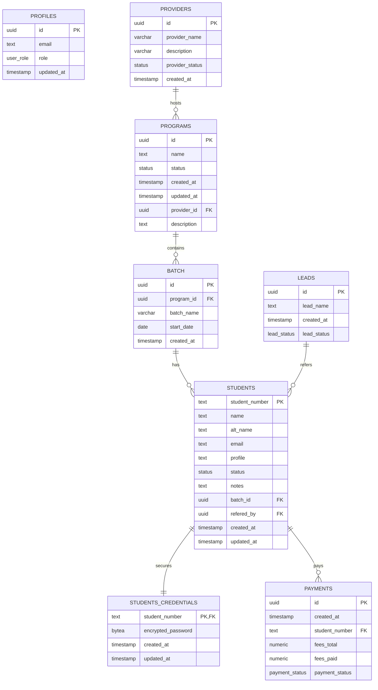

# Supabase Database Schema Documentation

This document provides a reference for the Supabase database schema utilized in this project.

---

## Core Entities and Relationships

The database is designed to manage an educational or student-tracking system. The primary entities and their relationships are structured as follows:

---

## Table Descriptions

### 1. `public.profiles`
Stores supplemental metadata and role permissions for authenticated users of the system.
* **`id`** (`uuid`, Primary Key): References `auth.users(id)`.
* **`email`** (`text`, Unique): Email address of the user.
* **`role`** (`user_role` enum): Role assigned to the user (e.g., `'employee'`).
* **`updated_at`** (`timestamp with time zone`): Last update timestamp, defaults to `now()`.

### 2. `public.providers`
Organizations or partners that deliver educational programs.
* **`id`** (`uuid`, Primary Key): Unique identifier, defaults to a generated UUID.
* **`provider_name`** (`character varying`): Name of the provider.
* **`description`** (`character varying`): Brief description of the provider.
* **`provider_status`** (`status` enum): Status of the provider, defaults to `'ACTIVE'`.
* **`created_at`** (`timestamp with time zone`): Time when the provider record was created.

### 3. `public.programs`
Curriculums or courses offered under a specific provider.
* **`id`** (`uuid`, Primary Key): Unique identifier, defaults to a generated UUID.
* **`name`** (`text`): Name of the program.
* **`status`** (`status` enum): Status of the program, defaults to `'ACTIVE'`.
* **`provider_id`** (`uuid`, Foreign Key): References `public.providers(id)`.
* **`description`** (`text`): Program description.
* **`created_at` / `updated_at`** (`timestamp with time zone`): Lifecycle tracking timestamps.

### 4. `public.batch`
Specific class cohorts created under a program.
* **`id`** (`uuid`, Primary Key): Unique identifier, defaults to a generated UUID.
* **`program_id`** (`uuid`, Foreign Key): References `public.programs(id)`.
* **`batch_name`** (`character varying`): Name/Code of the batch.
* **`start_date`** (`date`): Official start date of the cohort.
* **`created_at`** (`timestamp with time zone`): Time when the batch was created.

### 5. `public.leads`
Referral channels or marketing lead sources through which students register.
* **`id`** (`uuid`, Primary Key): Unique identifier, defaults to a generated UUID.
* **`lead_name`** (`text`, Unique): Name of the lead source.
* **`lead_status`** (`lead_status` enum): Operational status of the lead.
* **`created_at`** (`timestamp with time zone`): Lifecycle tracking timestamp.

### 6. `public.students`
Core student registry details including status, cohort assignment, and referral channel.
* **`student_number`** (`text`, Primary Key): Unique registration number or code.
* **`name`** (`text`): Full name.
* **`alt_name`** (`text`): Alternate/preferred name.
* **`email`** (`text`): Contact email.
* **`profile`** (`text`): Additional profile details or URL.
* **`status`** (`status` enum): Current enrollment status.
* **`notes`** (`text`): General administrative remarks.
* **`batch_id`** (`uuid`, Foreign Key): References `public.batch(id)`.
* **`refered_by`** (`uuid`, Foreign Key): References the lead source in `public.leads(id)`.
* **`created_at` / `updated_at`** (`timestamp with time zone`): Lifecycle tracking timestamps.

### 7. `public.students_credentials`
Stores encrypted credentials for students who access the student-facing portal.
* **`student_number`** (`text`, Primary Key, Foreign Key): References `public.students(student_number)`.
* **`encrypted_password`** (`bytea`): Hashed password.
* **`created_at` / `updated_at`** (`timestamp with time zone`): Lifecycle tracking timestamps.

### 8. `public.payments`
Financial ledger tracking total fees and payment progress for enrolled students.
* **`id`** (`uuid`, Primary Key): Unique identifier, defaults to a generated UUID.
* **`student_number`** (`text`, Foreign Key): References `public.students(student_number)`.
* **`fees_total`** (`numeric`): Total fees billed.
* **`fees_paid`** (`numeric`): Total fees received, defaults to `0`.
* **`payment_status`** (`payment_status` enum): Status of the student's balance.
* **`created_at`** (`timestamp with time zone`): Record creation timestamp.
